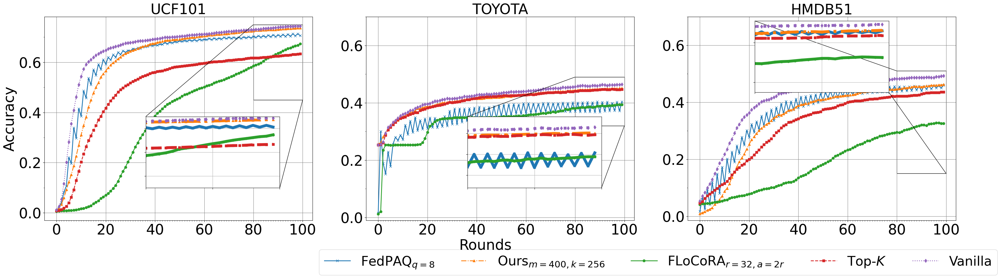

# Federated-Discriminative-Subspace-Discovery
We propose  `Federated discriminative subspace discovery`, a framework that collaboratively identify and operate within a  discriminative subspace. Instead of communicating full classifier updates, each client in federated learning first projects its local video embeddings using a shared random projection matrix. It then computes the covariance of the projected embeddings and transmits this statistic to the server for aggregation. The server reconstructs a global covariance matrix, performs singular value decomposition, and selects the $top-k$ eigenvectors that define the global class-discriminative subspace. Subsequent communication occurs only in this compact subspace. Extensive experiments on UCF101, HMDB51, and Toyota-SmartHome demonstrate that, learning and sharing the classifier in the discovered subspace, reduces communication costs by up to $61$%, with a moderate drop in activity recognition accuracy compared to the full model.


# Installing the required packages
Make sure to create a python virtual environment 
```python
# Working with Mac
python -m venv environment_name
# to activate it
source bin/activate/environment_name
# In your terminal type the command  below to install the required packages
pip install -r requirements.txt
```
# Preparing the data
We extracted embeddings from `Mvit` and `ResNet-3D-18` for both the `UCF101` and `HMDB51` and the `Toyota-smarthome` dataset. You can find the sample datasets in the Data folder (HMDB51, PS: GitHub only allows a max of 25MB upload). You can also reproduce the entire dataset for this project by running the file below:
```python
python src\run_extract_emb.py
```
# Running the evidence plot (Figure 1)
Consider changing the directory of the embeddings files to reflect your own directories change this:
```python
    paths=[
        [
        ("data/Mvit_embds/TOYOTA/toyota_train/*.joblib","data/Mvit_embds/TOYOTA/toyota_test/*.joblib","TOYOTA"),
        ("data/Mvit_embds/UCF101/ucf101_train/*.joblib","data/Mvit_embds/UCF101/ucf101_test/*.joblib","UCF101"),
        ("data/Mvit_embds/HMDB51/hmdb51_train/*.joblib","data/Mvit_embds/HMDB51/hmdb51_test/*.joblib","HMDB51")
        ],
        [
            ("data/Resnet18_embds/TOYOTA/train_embeddings/*.joblib","data/Resnet18_embds/TOYOTA/test_embeddings/*.joblib","TOYOTA"),
            ("data/Resnet18_embds/UCF101/train_embeddings/*.joblib","data/Resnet18_embds/UCF101/test_embeddings/*.joblib","UCF101"),
            ("data/Resnet18_embds/HMDB51/train_embeddings/*.joblib","data/Resnet18_embds/HMDB51/test_embeddings/*.joblib","HMDB51")

        ]
        ]
```
Then run the command below in your terminal:
```python
python src\run_evidence.py
```
A plot will be automatically generated in your current directory (see  Figure 1 below):

|  Figure 1                                                     |              Figure 2                                     |
|---------------------------------------------------------------|-----------------------------------------------------------|
|                          |                              |

## Experiments
Because the different methods use the same argument parser file, to run the `baselines` you need to add the `--method vanilla` to it anytime you run them.
Below are sample experiments run with a batch script.
```bash
# Run this in your terminal or sever
python src\main.py --method angular_pca
python src\main.py --method vanilla
python src\baseline_top_k_gradient.py --method vanilla
python src\baseline_quantized.py --method vanilla
python src\baseline_flocoara.py --method vanilla
```
