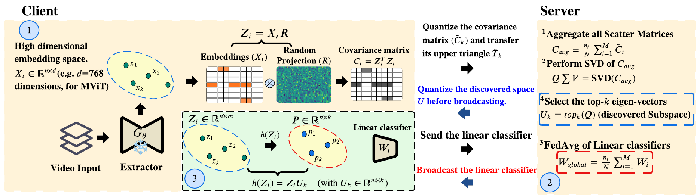

# Federated-Discriminative-Subspace-Discovery
We propose  `Federated discriminative subspace discovery`, a framework that collaboratively identify and operate within a  discriminative subspace. Instead of communicating full classifier updates, each client in federated learning first projects its local video embeddings using a shared random projection matrix. It then computes the covariance of the projected embeddings and transmits this statistic to the server for aggregation. The server reconstructs a global covariance matrix, performs singular value decomposition, and selects the $top-k$ eigenvectors that define the global class-discriminative subspace. Subsequent communication occurs only in this compact subspace. Extensive experiments on UCF101, HMDB51, and Toyota-SmartHome demonstrate that, learning and sharing the classifier in the discovered subspace, reduces communication costs by up to $61$%, with a moderate drop in activity recognition accuracy compared to the full model.

