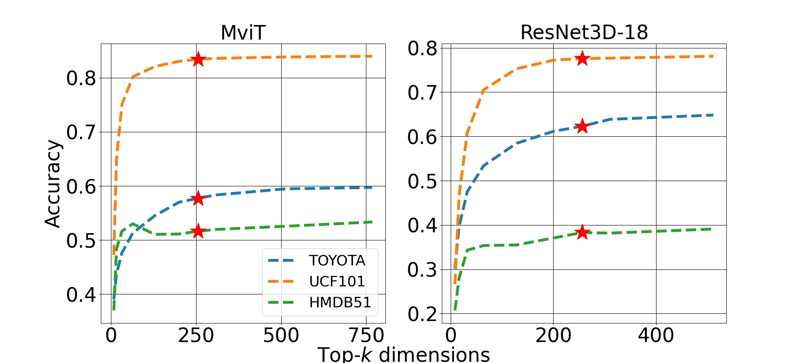

# Federated-Discriminative-Subspace-Discovery
We propose  `Federated discriminative subspace discovery`, a framework that collaboratively identify and operate within a  discriminative subspace. Instead of communicating full classifier updates, each client in federated learning first projects its local video embeddings using a shared random projection matrix. It then computes the covariance of the projected embeddings and transmits this statistic to the server for aggregation. The server reconstructs a global covariance matrix, performs singular value decomposition, and selects the $top-k$ eigenvectors that define the global class-discriminative subspace. Subsequent communication occurs only in this compact subspace. Extensive experiments on UCF101, HMDB51, and Toyota-SmartHome demonstrate that, learning and sharing the classifier in the discovered subspace, reduces communication costs by up to $61$%, with a moderate drop in activity recognition accuracy compared to the full model.


# Installing the required packages
Make sure to create a python virtual environment 
```python
# Working with Mac
python -m venv environment_name
# to activate it
source bin/activate/environment_name
# In your terminal type the command  below to install the required packages
pip install -r requirements.txt
```
# Preparing the data
We extracted embeddings from `Mvit` and `ResNet-3D-18` for both the `UCF101` and `HMDB51` and the `Toyota-smarthome` dataset. You can find the sample datasets in the Data folder (HMDB51, PS: GitHub only allows a max of 25MB upload). You can also reproduce the entire dataset for this project by running the file below:
```python
python src\run_extract_emb.py
```
# Running the evidence plot (Figure 1)
Consider changing the directory of the embeddings files to reflect your own directories, then run the command below in your terminal:
```python
python src\run_evidence.py
```
A plot will be automatically generated in your current directory (see below):

|  For both MViT and ResNet-3D-18, increasing the subspace dimensionality leads to an increase in accuracy, which then begins to plateau at approximately $256$ dimensions.         |
|---------------------------------------------------------------|  
|                          |

```bash
# List your Python scripts in the order you want to execute
python src\main.py --method angular_pca
python src\main.py --method vanilla
python src\baseline_top_k_gradient.py --method vanilla
python src\baseline_quantized.py --method vanilla
python src\baseline_flocoara.py --method vanilla
```
